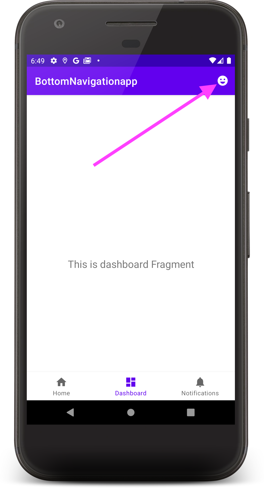
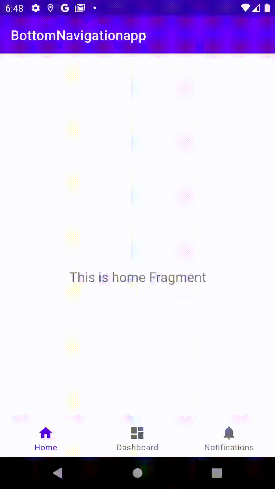

Sample project to reproduce fragment menu inflation regression
==============================================================

The app currently functions as expected:
* When you select the "Dashboard" tab, an emoji action bar icon appears:
    -  
* When you select either the "Home" or "Notifications" tab, the action bar icon disappears
    -  

Steps to reproduce the issue:
* Upgrade the activity and fragment dependencies:
    ```patch
    -    implementation 'androidx.activity:activity-ktx:1.1.0'
    -    implementation 'androidx.fragment:fragment-ktx:1.2.5'
    +    implementation 'androidx.activity:activity-ktx:1.2.0'
    +    implementation 'androidx.fragment:fragment-ktx:1.3.0'
    ```
* Rebuild and launch the app
* Expected behavior: Same as described above: clicking on the dashboard tab (and only the dashboard tab) should make the emoji action bar icon appear
* Actual behavior:  The emoji action bar icon never appears


Possible workarounds
--------------------

Workaround #1:
* In `MainActivity.onCreate()`, add:
  `FragmentManager.enableNewStateManager(false)`

Workaround #2:
* In `DashboardFragment`, add:
    ```kotlin
    override fun onHiddenChanged(hidden: Boolean) {
        super.onHiddenChanged(hidden)
        requireActivity().invalidateOptionsMenu()
    }
    ```

Only one of the above workarounds is needed.
